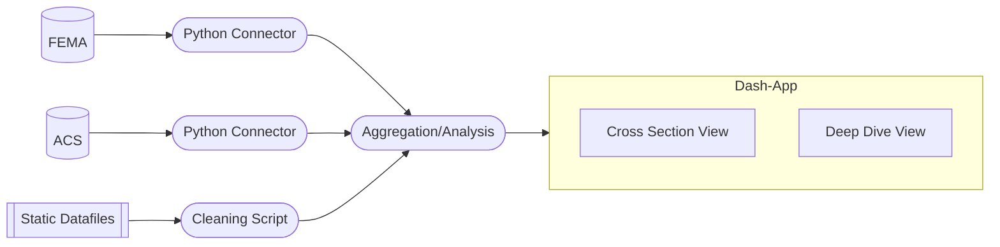

# Project: Nautral Disaster Aid and Demographics
### Team: (la)Monty Python 
### Team Members: Aditya, Ali), Wes and Zander

## Project Overview
Our project enables exploration of various demographic, economic, and political features on federal government aid to counties after natural disasters in the U.S. We collect data from several government sources, including the Census Bureau and FEMA, to capture demographic, economic, and natural disaster measures. Our project includes a Plotly Dash interface where users can interact with the data to explore the relationship between various demographic variables and FEMA aid provided to counties affected by natural disasters. 

## Software Structure

The software consists of two abstract class connections to two separate APIs (and several downloaded static datasources) on the backend, a data integration and analysis middle layer, and a Plotly Dash frontend. The backend of our project connects to the following APIs and static datasources:  
- <a href='https://www.census.gov/programs-surveys/acs/data/data-via-api.html'>American Community Survey from the U.S. Census Bureau</a>  
- <a href='https://www.fema.gov/about/openfema/data-sets#disaster'>OpenFEMA Datasets</a>  
- <a href='https://electionlab.mit.edu/data'>MIT Election Lab Federal Elections Data</a>  
- <a href='https://www.nhc.noaa.gov/data/'>NOAA National Hurrican Center Data</a>
  

The middle layer combines the data by aggregating and joining ACS data with FEMA aid data. The middle layer also performs pre-processing on presidential voting and hurricane path static datafiles. After the data has been processed, the middle layer also performs several regressions on a subset of three specific hurricanes: Irma, Michael, and Harvey. Our Regression and API Data Pull classes are designed in a scalable manner so additional disasters can be added with little effort.

The front end of our application renders data across multiple views and data visualizations in a Plotly Dash interface. The interface allows the user to explore the realtionship between various demographic variables and FEMA aid in counties affected by natural diasters from 2010-2019. The frontend consists of two views:
- Cross Section: user can explore the relationship between demographics and FEMA aid provided at the county-disaster level, exploring how different county demographic factors are related with aid levels for a given disaster or disasters.  
- Deep Dive: user can view specific statistical relationships between demographics and aid, as well as geographic data, of three specific hurricanes.   

## Code Responsibilities
- Everyone: code reviews; collaborative code troubleshooting  
- Aditya: project management; Dash frontend, deep dive view  
- Ali: FEMA API; ACS & FEMA blending; shell script  
- Wesley: ACS API; data cleaning & statistical models  
- Zander: frontend wireframing & styling; Dash frontend, cross-sectional view

## App Interaction (Setup)
To launch the user interface from the UChicago Virtual Desktop (locally, skip to step 2):
1. Follow the guide for accessing the virtual desktop <a href='https://classes.cs.uchicago.edu/current/30122-1/resources/virtual-desktop.html'>here</a>  
2. After cloning the code, open a terminal and navigate to ./lamontypython/ within the root directory.  
3. Run the shell script "install_and_run.sh" from this directory to setup a virtual environment and then run the code (this may take a few minutes).  
4. Once the script is running you should see a URL to the dash app in the terminal like this:  
    ``Dash is running on http://127.0.0.1:8050/``  
Copy the url into Google Chrome (not Firefox, not all visuals will work) and you're in!  
